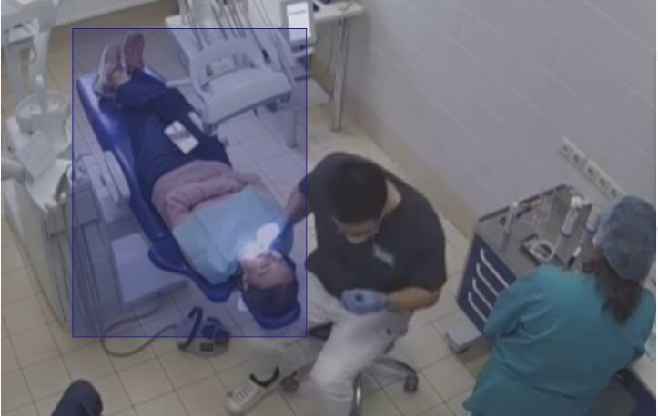
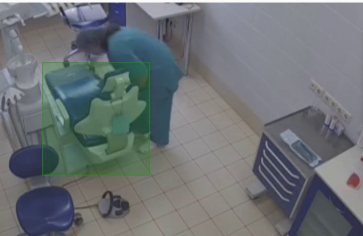
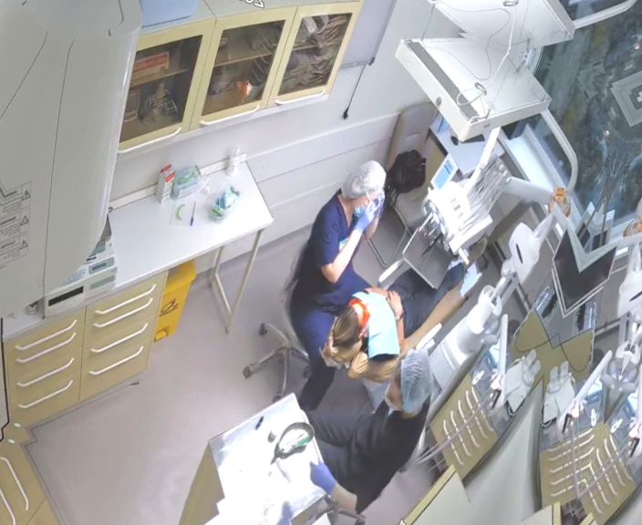
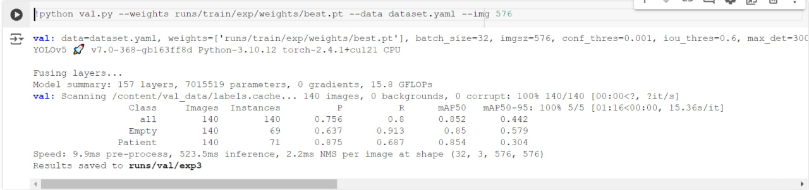

# Отчет по проекту на стажировке в МЕДСИ
Нургалиев Родион
---

## Обзор проекта

Данный проект включает в себя обучение модели YOLOv5 для определения, сидит ли пациент в стоматологическом кресле во время приёма, дабы избежать незапланированных и незарегистрированных записей. Проект использует видеозаписи с камер видеонаблюдения, которые были обработаны и размечены для выполнения задач обнаружения объектов.

## Выполненные шаги

1. **Обработка видео:**
   - Исходные два видео были разделены на кадры с частотой 1.5 кадра в секунду с использованием `ffmpeg`, в результате чего было отобрано 140 изображений на каждое видео.
   - Из этих кадров было выбрано 70 изображений, на которых пациент сидит в кресле, и 70 изображений, на которых кресло пустое.
   - Итого получилось 280 кадров на 2 видеозаписи.

2. **Ручная аннотация:**
   - Изображения были размечены вручную с помощью Label Studio, создав проект для детекции объектов.
   - Всего было 2 категории:
     - **Синий квадрат:** Указывает на кресло, когда пациент присутствует (названо "Patient").
     - **Зеленый квадрат:** Указывает на кресло, когда оно пустое (названо "Empty").
   - Аннотации были экспортированы в формате YOLO.
Пример изображения с пациентом:


Пример изображения с пустым креслом:


3. **Аугментация:**
   - Проведена аугментация данных с помощью скрипта `augment_yolo.py`, который находится в папке `augmentation`, для улучшения набора данных.
   - Аугментация была проведена по следующим параметрам:
      - Горизонтальное отражение
      - Изменение яркости и контрастности 
      - Добавление шума
      - Изменение оттенка, насыщенности и значения
      - Размытие изображения
      - Сдвиг, масштабирование и поворот
      - Поворот на случайный угол
Пример аугментированного изображения:


5. **Обучение модели:**
- Для оценки качества детекции выбрал **mAP** как целевую метрику. Так как у нас 2 класса, то он будет учитывать правильность классификации.
- Моделью была выбрана YoloV5S, так как она высокую скорость, работая около реал тайм, а также имеет точное обнаружение объектов.
- Ноутбук с обучением сохранен и называется **MEDSI_YoloV5S_train.ipynb**
- Для определение гиперпараметров была использована встроенная функция оптимизации evolve
- Лучшие веса модели были сохранены как `best.pt`.

train_data содержала 420 изображений на которых и училась модель. 280  из 420 картинок были аугментированные
val_data содержала 140 валидационных изображений, на которых модель проверялась и которые не присутствовали в train_data.

- Модель показала результат 0.852 по целевой метрике **mAP50**


6. **Инференс:**
- Предоставлен скрипт для инференса `run_yolov5s_model.py` для запуска обученной модели на новых изображениях или видеопотоках.

## Файлы набора данных

```
MEDSI_internship_project_Nurgaliev/
│
├── augmentation/
│   └── augment_yolo.py
│
├── content/
│   ├── train_data/
│   │   ├── classes.txt
│   │   ├── notes.json
│   │   ├── images/    # папка с картинками в формате PNG
│   │   └── labels/    # папка с аннотациями в формате TXT
│   │
│   └── val_data/
│       ├── classes.txt
│       ├── notes.json
│       ├── images/    # папка с картинками в формате PNG
│       └── labels/    # папка с аннотациями в формате TXT
│
├── best.pt
├── MEDSI_YoloV5S_train.ipynb
└── run_yolov5s_model.py
```

1. **train_data** - Данные для обучения
2. **val_data** - Валидационные данные

- **classes.txt:** Содержит имена классов для обнаруживаемых объектов.
- **notes.json:** Метаданные о наборе данных, включая идентификаторы категорий.
- **images/**: Папка, содержащая аннотированные изображения.
- **labels/**: Папка, содержащая соответствующие файлы аннотаций.

## Заключение

Данный проект демонстрирует применение YOLOv5 для обнаружения объектов в реальном времени в медицинской сфере. Размеченный набор данных и обученная модель могут быть использованы для детекции постетителей во избежании незарегистрированных приёмов.
